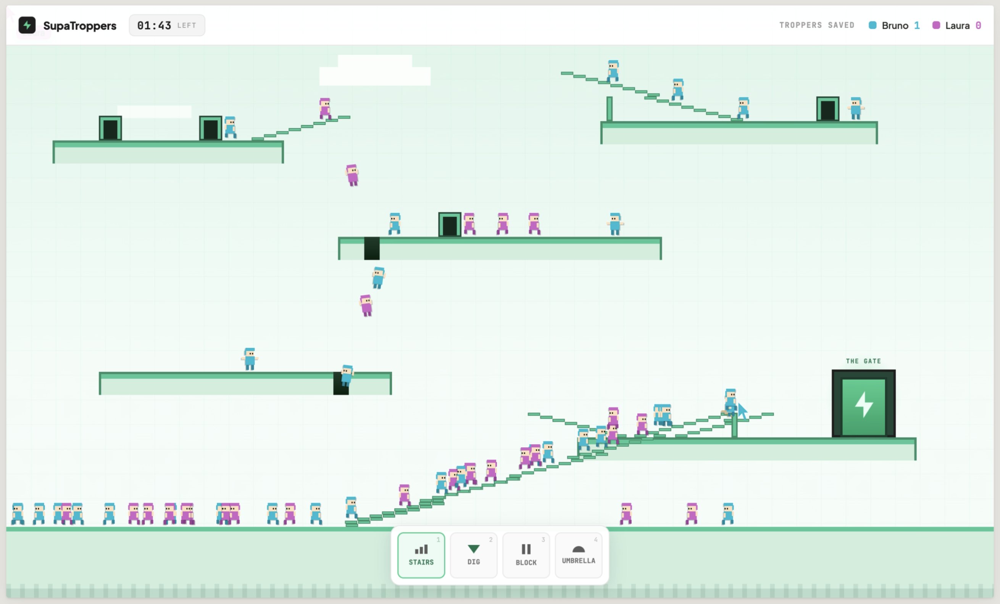

# SupaTroppers

**A real-time multiplayer game powered by [Supabase](https://supabase.com) — save the troppers together.**



---

SupaTroppers is a cooperative pixel-art game inspired by the classic [Lemmings](https://en.wikipedia.org/wiki/Lemmings_(video_game)). Up to 10 players share the same screen in real time, each controlling tools to guide a swarm of troppers safely to the exit before time runs out.

No account needed. No install. Just click and play.

## Play now

Visit **[https://bruno222.github.io/supatroppers/](https://bruno222.github.io/supatroppers/)** and press **Play** — share the link with a friend and jump in together.

Use tools like **Stairs**, **Dig**, **Block**, and **Umbrella** to steer your troppers to safety. Each save counts. Beat your high score together.

---

## Built with

- **[Supabase Realtime](https://supabase.com/realtime)** — broadcast channels sync every player action with sub-100ms latency, no database rows required
- **React + Vite + TypeScript** — frontend, deployed to GitHub Pages
- **Hono + Node.js** — authoritative brain server, deployed to fly.io

---

## Run locally

1. Create a free Supabase project at [supabase.com](https://supabase.com) (broadcast-only — no DB tables needed).
2. Copy your project URL and anon key into env files:

   ```
   cp frontend/.env.example frontend/.env
   cp brain-server/.env.example brain-server/.env
   ```

3. Install and start:

   ```
   pnpm install
   pnpm dev
   ```

   Frontend at `http://localhost:5173`, brain server at `http://localhost:8080/health`. Open two browser tabs to play with yourself.

> If `.env` is missing, the frontend renders in demo mode with a banner explaining what's missing.

## Deploy your own instance

### One-time setup

1. **GitHub repo secrets** (Settings → Secrets → Actions):
   - `SUPABASE_URL`
   - `SUPABASE_ANON_KEY`
   - `FLY_API_TOKEN` — run `flyctl tokens create deploy -x 999999h` from `brain-server/`
2. **GitHub Pages**: Settings → Pages → Source = "GitHub Actions".
3. **fly.io**: from `brain-server/` run `fly launch --no-deploy`

### Github Actions

Pushing to `main` triggers:
- `deploy-frontend.yml` → GitHub Pages (on changes under `frontend/`, `shared/`, or the workflow)
- `deploy-brain.yml` → fly.io (on changes under `brain-server/`, `shared/`, or the workflow)
